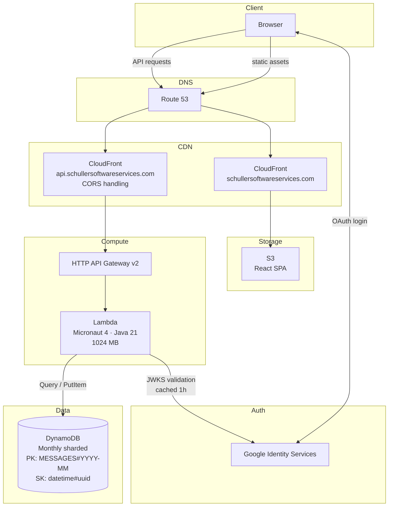
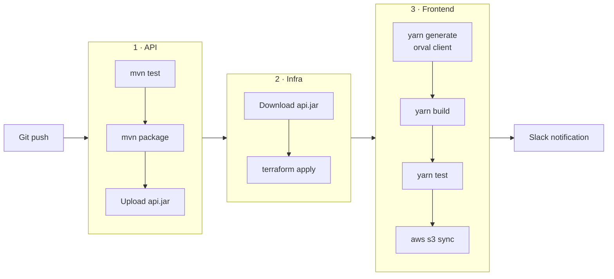

# Schuller Software Services


Personal site and API monorepo. React frontend, Micronaut/Java backend running on AWS Lambda, all infrastructure managed with Terraform.

---

## Architecture



---

## Repo Structure

```
.
├── api/api/                  # Micronaut Java backend
│   ├── src/main/java/        # Controllers, repositories, models
│   ├── src/main/resources/   # application.yml, application-local.yml
│   └── src/test/             # Unit + Lambda handler integration tests
│
├── frontend/schuller-software-services/
│   ├── src/
│   │   ├── api/              # Axios client + orval-generated typed functions
│   │   ├── components/       # React components + .styles.ts companions
│   │   └── containers/       # Layout components + AuthProvider
│   └── orval.config.ts       # Client generation config
│
├── infra/                    # Terraform
│   ├── api-gateway.tf        # HTTP API Gateway v2 + CORS
│   ├── cloudfront.tf         # CloudFront distributions + Route 53
│   ├── dynamo.tf             # DynamoDB table
│   ├── lambda.tf             # Lambda function + IAM
│   └── s3.tf                 # Frontend bucket
│
├── spec/
│   └── openapi.yml           # OpenAPI spec (generated from Micronaut, committed as contract)
│
└── .github/workflows/
    └── deploy.yml            # CI/CD pipeline
```

---

## CI/CD Pipeline



---

## Local Development

**Backend**

```bash
cd api/api
./mvnw mn:run -Dmicronaut.environments=local
# Runs on http://localhost:8080
# application-local.yml enables CORS for localhost:3000
```

**Frontend**

```bash
cd frontend/schuller-software-services
cp .env.local.example .env.local   # set REACT_APP_API_HOST=http://localhost:8080
yarn install
yarn generate   # regenerate typed API client from spec/openapi.yml
yarn start      # http://localhost:3000
```

**Regenerating the OpenAPI client** (after backend changes)

```bash
cd api/api && ./mvnw compile
cp target/classes/META-INF/swagger/swagger.yml ../../spec/openapi.yml
cd ../../frontend/schuller-software-services && yarn generate
```
